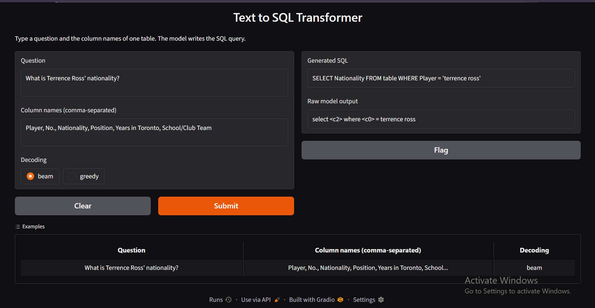
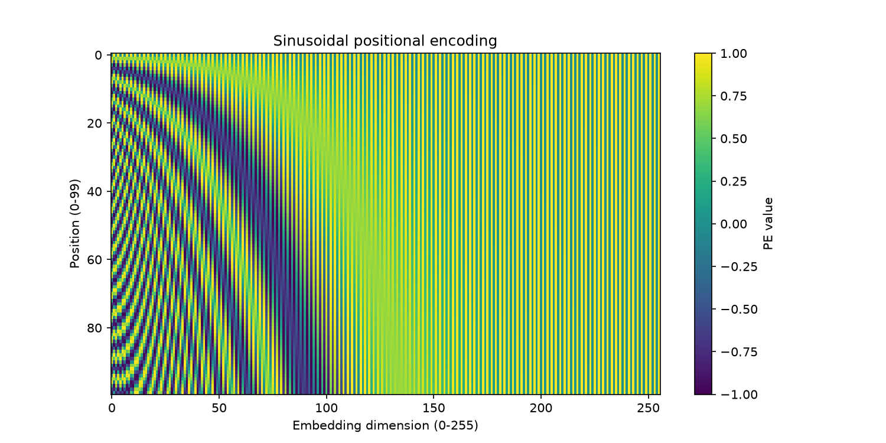
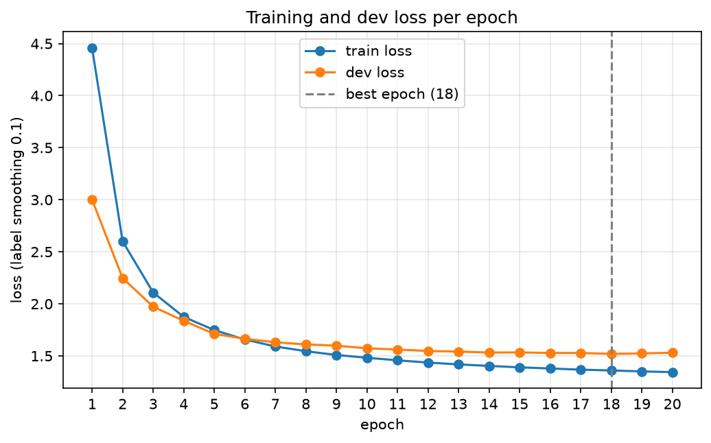
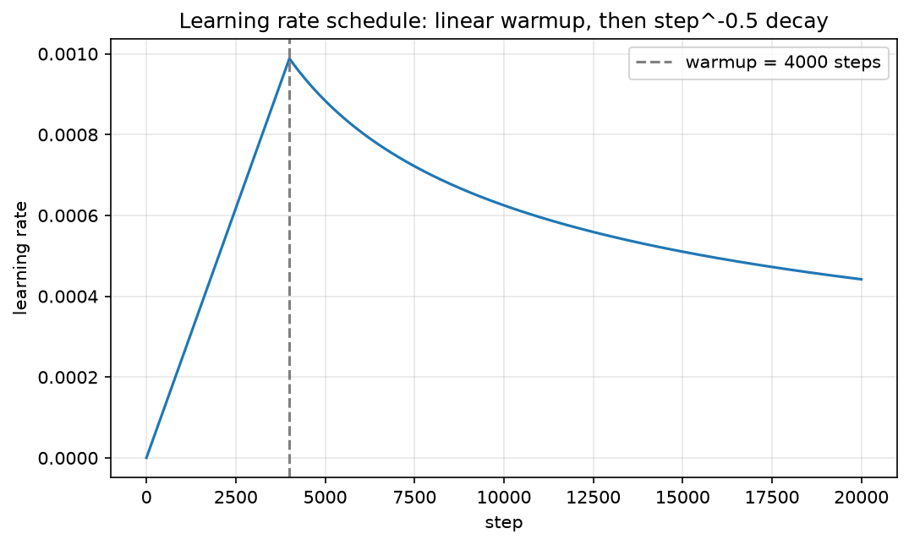
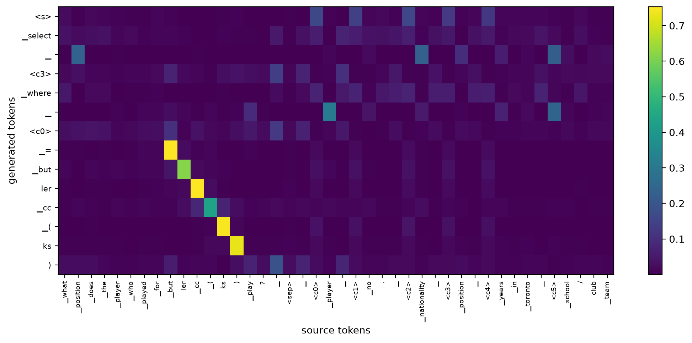

# Text-to-SQL with a Transformer (built and trained from scratch)

An English question plus the column names of one table goes in, and a SQL query comes out. The encoder-decoder Transformer from *Attention Is All You Need* is implemented from basic PyTorch layers and trained from random initialisation on WikiSQL. No pretrained weights, no `nn.Transformer`, no Hugging Face.

## Team and contributions

**Ayesha Tariq** (GitHub: ashley400)
- Data statistics and positional-encoding heat-map (Task 1)
- Transformer model: attention, layers (Task 2)
- Training: loss, optimiser, learning-rate schedule, checkpointing (Task 3)
- Correctness checks, loss and learning-rate plots
- Results tables, README and blog

**Muhammad Momin Nadeem**
- Transformer model: layers, masks, full model (Task 2)
- Decoding: greedy, beam search, parser, readable SQL (Task 4)
- Evaluation: prediction files, component accuracy, samples, attention map (Task 5)
- Front end (Task 6)

## How to run

1. Install the requirements from `requirements.txt`.
2. Download WikiSQL and place it at `starter/WikiSQL` (the data must be at `starter/WikiSQL/data`).
3. From `starter/`, run `data_prep.py`, then `tokenizer.py`, then `check_starter.py`.
4. Train with `train.py` (20 epochs, Colab T4). The best checkpoint is saved to `checkpoints/best.pt` (about 31 MB, included in the repository).
5. Evaluate with `evaluate_model.py`, using `--split dev` or `--split test` and `--method greedy` or `--method beam`. The `--extras` flag also writes the component accuracy, `samples.md` and the attention map. The test split is evaluated once.
6. Score the prediction files in `results/` with the official WikiSQL `evaluate.py`.
7. Run `checks.py` for the correctness checks.
8. Start the front end with `app/app.py` and open the local address it prints (http://127.0.0.1:7860).

## Model and training configuration

d_model 256, 4 heads (d_k = d_v = 64), 3 encoder and 3 decoder layers, d_ff 1024, dropout 0.1, post-norm, shared encoder/decoder/output embedding, shared 8,000-piece BPE vocabulary. Label smoothing 0.1, Adam (beta1 0.9, beta2 0.98, eps 1e-9), warmup of 4000 steps, batch size 64, 20 epochs, best checkpoint chosen by dev loss.

## Results

The same tables are in `results/tables.md`.

### Table 1 - Data

| | Train | Dev | Test |
|---|---|---|---|
| Pairs | 56,355 | 8,421 | 15,878 |
| Mean / max source length (tokens) | 42.5 / 222 | 42.5 / 167 | 42.7 / 260 |
| Mean / max target length (tokens) | 14.8 / 65 | 14.8 / 44 | 14.9 / 46 |
| Pairs dropped as too long | 19 | - | - |

### Table 2 - Model and training

| Item | Value |
|---|---|
| Trainable parameters | 7,577,600 |
| Epochs trained / best epoch | 20 / 18 |
| Best dev loss | 1.5194 (with label smoothing 0.1) |
| Training time and GPU | about 21 min, Tesla T4 |

### Table 3 - Official metrics

| Split | Decoding | Logical form (%) | Execution (%) | Parse failures (%) |
|---|---|---|---|---|
| Dev | greedy | 51.78 | 59.47 | 0.56 |
| Dev | beam (4) | 51.67 | 59.49 | 0.52 |
| Test | beam (4) | 52.16 | 59.26 | 0.49 |

Beam search was used for the test set because it had the slightly higher dev execution accuracy (the difference to greedy is only 0.02 points).

### Table 4 - Component accuracy (dev, greedy)

| Component | Accuracy (%) |
|---|---|
| sel column correct | 81.01 |
| agg correct | 88.77 |
| WHERE clause correct | 64.22 |

## Correctness checks

| Check | Result |
|---|---|
| Weight sharing (output projection and embedding are the same tensor) | PASS |
| Causal mask (earlier positions unchanged when the last token changes) | PASS |
| Padding mask (output unchanged with extra pad tokens) | PASS |
| Attention rows sum to 1 | min 1.000000, max 1.000000 |
| Weight on pad positions | 0.00 |
| Trainable parameters | 7,577,600 |
| Gold round-trip (dev), execution accuracy | 99.49% (0 parse failures) |
| Gold round-trip (dev), logical form accuracy | 99.49% |
| Learning-rate schedule | linear rise for 4000 steps, then step^-0.5 decay (see figure) |

The raw output is in `results/checks_output.txt`. The 0.51% gold round-trip mismatch comes from tokenizer and whitespace normalisation of some gold values.

## Figures

**Positional encoding (first 100 positions x 256 dimensions).** _Add your two sentences here._

_Add one or two sentences about whether the generated column tokens attend to the matching column in the source._

## Qualitative samples

Ten dev examples (five correct, five wrong, with failure types) are in `results/samples.md`.
